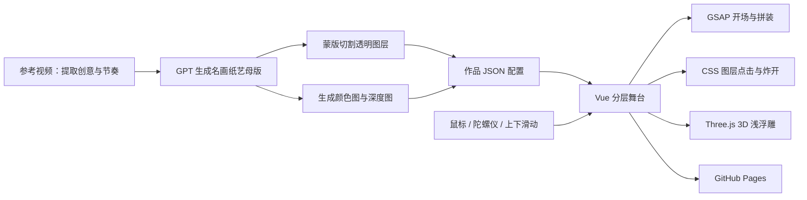

# 世界名画剪纸拆解

一个将世界名画转化为可交互剪纸舞台的网页实验，也是一次 **GPT Work 视频理解与创意还原测试**。

[在线体验](https://god2father.github.io/gptwork-painting-paper/)

## 项目目的与灵感来源

项目以一段展示最终效果的视频作为输入，让 GPT Work 理解其中的视觉语言、运动节奏与交互想法，再独立实现为真正可操作的网页。

参考视频只用于创意分析，不作为仓库内容或网页素材发布；网站不播放视频、GIF 或序列帧，也不重新发布视频画面和音乐。网页中的画作母版由 GPT 生成，再通过透明蒙版进行独立分层处理。

目前包含：

- 约翰内斯·维米尔《戴珍珠耳环的少女》
- 扬·凡·艾克《阿尔诺芬妮夫妇像》

## 总体实现方案

网站采用“GPT 素材生成 + DOM 透明图层 + GSAP 时间轴 + Three.js 浅浮雕”的混合方案。



## 一、名画素材生产

每幅作品先生成一张完整母版：

- [`assets/originals/painting-01/original.png`](assets/originals/painting-01/original.png)
- [`assets/originals/painting-02/original.png`](assets/originals/painting-02/original.png)

然后按语义拆成背景、人物衣身、面部、头饰、手部、耳环、小狗等独立图层。

每个图层都保持与母版相同的画布尺寸，并使用透明 WebP 保存。图层静止时可以像拼图一样精确还原母版，避免耳环、头巾等局部元素错位。

分层脚本：

- [`scripts/extract_painting_layers.py`](scripts/extract_painting_layers.py)
- [`scripts/extract_painting_02_layers.py`](scripts/extract_painting_02_layers.py)

每幅作品还会生成：

- `relief-color.webp`：3D 模型表面颜色。
- `relief-depth.webp`：灰度深度图，越亮的位置向用户方向抬得越高。
- `layer-preview.png`：检查全部透明图层是否可以重新拼成完整画面。
- `masks/`：保存每个语义区域的透明蒙版。

生成提示词、日期、输入和后处理步骤记录在 `assets/originals/` 中。

## 二、作品 JSON 配置

每幅画由独立 JSON 描述：

- [`manifests/paintings/painting-01.json`](manifests/paintings/painting-01.json)
- [`manifests/paintings/painting-02.json`](manifests/paintings/painting-02.json)

配置包含：

- 标题、作者、年代和作品介绍。
- 原始画布尺寸。
- 背景、颜色图和深度图路径。
- 每个纸片的坐标、宽高和层级。
- 飞入起点、经过点、持续时间和缓动。
- 点击后的浮起高度、位移、旋转和缩放。
- 鼠标与陀螺仪视差幅度。
- 珍珠闪光、包布摆动、小狗动作等常驻效果。
- Three.js 网格密度、浮雕深度、倾斜角度和阻尼。

加载时通过 [`src/lib/scene/painting.ts`](src/lib/scene/painting.ts) 校验配置，避免错误坐标、路径或缺失字段进入舞台。

## 三、页面组件结构

```text
App
└── WorkspaceStage
    ├── 木桌背景与暗角
    ├── PortraitFrame
    │   └── LayeredStage
    │       ├── 背景图
    │       ├── StageLayer × N
    │       └── PortraitReliefOverlay
    ├── 作品信息卡
    ├── 作品介绍卡
    ├── 炸开控制卡
    └── 开场裁纸遮罩
```

主要职责：

- [`src/App.vue`](src/App.vue)：管理当前作品、作品切换和整体转场。
- [`src/features/stage/WorkspaceStage.vue`](src/features/stage/WorkspaceStage.vue)：木桌、画框、信息卡、裁纸开场和手机滑动。
- [`src/features/stage/LayeredStage.vue`](src/features/stage/LayeredStage.vue)：组合背景、透明图层和 WebGL 浮雕。
- [`src/features/stage/StageLayer.vue`](src/features/stage/StageLayer.vue)：渲染单个可点击纸片。
- [`src/features/stage/PortraitReliefOverlay.vue`](src/features/stage/PortraitReliefOverlay.vue)：承载 Three.js Canvas。
- [`src/features/stage/PaperLabel.vue`](src/features/stage/PaperLabel.vue)：作品档案、介绍、批注和炸开控制。

## 四、开场裁纸动画

开场由四张半屏纸片组成：

- 上半部分静态纸。
- 下半部分静态纸。
- 上半部分裁切后的纸。
- 下半部分裁切后的纸。

四层都带有繁体“紙”字，并分别裁出上半字和下半字，所以静止时看起来仍是一个完整文字。

执行顺序：

1. 整个屏幕由纸张覆盖。
2. 裁纸刀从右向左快速划过。
3. 静态纸逐渐隐藏，裁切后的两片纸逐渐显现。
4. 刀具完整越过屏幕最左侧。
5. 上层纸向上离开。
6. 下层纸向下离开。
7. 露出木桌与第一幅画。
8. 名画纸片开始飞入。

动画由 [`src/lib/motion/buildTimeline.ts`](src/lib/motion/buildTimeline.ts) 使用 GSAP 组织。

## 五、纸片飞入拼装

每个图层都在作品 JSON 中定义独立轨迹：

```json
{
  "start": 2.15,
  "duration": 1.3,
  "from": {
    "x": 650,
    "y": -520,
    "rotation": 12,
    "scale": 0.9
  },
  "via": {
    "x": 230,
    "y": -160
  },
  "ease": "power3.out"
}
```

运行时会根据原画尺寸与当前屏幕尺寸换算坐标。纸片从 `from` 出发，经过 `via` 控制点形成弧形轨迹，最后回到自身在画面中的原始位置。

全部图层完成后触发 `assembled` 状态，页面从透明纸片组合状态过渡到 3D 浅浮雕状态。

## 六、Three.js 3D 浅浮雕

拼装完成后，Three.js 根据颜色图和深度图创建高密度网格：

1. 使用 `PlaneGeometry` 创建平面。
2. 按深度图灰度计算每个顶点的 Z 轴高度。
3. 使用颜色图作为模型表面纹理。
4. 添加背板厚度、环境光、主光和补光。
5. 鼠标或手机倾斜时旋转模型并改变光源方向。

核心实现在 [`src/features/stage/usePortraitRelief.ts`](src/features/stage/usePortraitRelief.ts)。

这样既能让整幅画产生真实的明暗与空间深度，又能继续保留 DOM 透明图层用于点击、闪光和独立浮起。

## 七、点击纸片与炸开效果

每个纸片都是一个透明语义按钮，位置来自 JSON 中的 `bounds`。

点击后：

1. Pinia 保存当前选中的图层 ID。
2. 对应纸片提高层级。
3. 通过 Z 轴位移、阴影、缩放和亮度产生浮起效果。
4. 页面出现该图层的说明卡。
5. SVG 红线连接纸片与说明卡。
6. 再次点击可收起。

“炸开全部图层”会给每个纸片应用独立的 X/Y 偏移、Z 轴高度、旋转角度和阴影。

交互状态集中在 [`src/stores/interaction.ts`](src/stores/interaction.ts) 中。

## 八、静止状态的局部动画

当前支持三类常驻效果：

- `sparkle`：珍珠耳环闪光。
- `breeze`：赭黄包布、头巾和小狗轻微摆动。
- `ambientHighlight`：凸面镜中央产生移动高光。

普通局部动画使用 CSS。需要真正形变的包布区域，会根据透明蒙版给 Three.js 顶点分配权重，只让指定区域产生波浪，而不是整张画一起晃动。

## 九、作品切换

切换时同时保留新旧两幅画约 950ms：

- 旧画框和画作向底部滑出。
- 新画框和画作从顶部进入。
- 木桌背景、信息区域和切换控制保持不动。

动画只施加在画框与画作专用容器上，不移动整个页面。

## 十、手机交互

### 陀螺仪

- Android 检测到方向传感器后自动监听。
- iPhone 因系统限制，在第一次点击画作时申请权限。
- 第一组有效数据作为当前握持角度基准。
- `beta/gamma` 转换成与鼠标一致的 `-1～1` 坐标。
- 输入经过范围限制和阻尼后，同时驱动纸片视差、光源和 3D 模型。
- 没有有效传感器数据时继续保留触摸交互。

坐标转换在 [`src/lib/motion/deviceOrientation.ts`](src/lib/motion/deviceOrientation.ts) 中。

### 上下滑动切换

- 向上滑：下一幅画。
- 向下滑：上一幅画。
- 纵向位移不足、横向幅度过大或只是点击时不触发。
- 成功识别滑动后拦截后续点击，避免误选纸片。

判断逻辑在 [`src/lib/motion/paintingSwipe.ts`](src/lib/motion/paintingSwipe.ts) 中。

## 十一、新增第三幅画的实现路径

1. 用 GPT 生成完整纸艺母版。
2. 记录生成提示词、日期和工具。
3. 确定需要独立移动和点击的语义区域。
4. 绘制每个区域的透明蒙版。
5. 导出全画布透明 WebP 图层。
6. 修复被人物遮挡的背景。
7. 生成 `relief-color.webp`。
8. 生成人工校正过的 `relief-depth.webp`。
9. 生成图层预览并检查能否精确重组。
10. 创建 `painting-03.json`。
11. 配置每层飞入轨迹、点击浮起、视差和环境动画。
12. 通过配置和素材校验。
13. 将作品加入作品列表。
14. 生成桌面与手机视觉截图。
15. 使用真机检查陀螺仪、点击和上下滑动。

## 十二、测试与发布

本地运行：

```bash
npm ci
npm run dev
```

验证命令：

```bash
npm run typecheck
npm test
npm run build
```

当前测试覆盖：

- TypeScript 类型检查。
- Vue 组件渲染。
- JSON 配置校验。
- GSAP 时间轴计算。
- 深度图映射。
- 陀螺仪坐标转换。
- 手机上下滑动识别。
- Pinia 交互状态。
- Python 素材输出。
- Vite 生产构建。

视觉截图保存在 [`tests/visual`](tests/visual)。

`main` 更新后，[GitHub Pages 工作流](.github/workflows/pages.yml) 会自动安装依赖、构建并发布 `dist`。

## 十三、当前架构可继续完善的部分

### 1. 作品自动发现

当前两幅画在 `App.vue` 中显式导入。继续增加作品时，建议使用 `import.meta.glob` 自动加载全部作品 JSON，避免修改核心组件。

### 2. 全局动画配置

作品图层的飞入轨迹已经由 JSON 驱动，但开场裁纸和画作切换时间仍是通用代码常量。可以进一步建立全局动效配置文件。

### 3. 独立纸片真实网格折叠

当前整体画面使用真实 Three.js 深度网格，点击纸片主要通过 CSS Z 轴浮起。如果需要更明显的沿中轴对折，可以为选中的纸片单独创建局部 Three.js 网格。

### 4. 移动端加载优化

可以继续将 Three.js 与第二幅画素材改成按需加载，减少首次访问的 JavaScript 和图片体积。

## 技术栈

- Vue 3
- TypeScript
- Vite
- GSAP + MotionPathPlugin
- Pinia
- Three.js
- Vitest
- Playwright
- Pillow
- GitHub Actions + GitHub Pages
